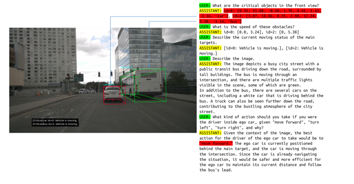
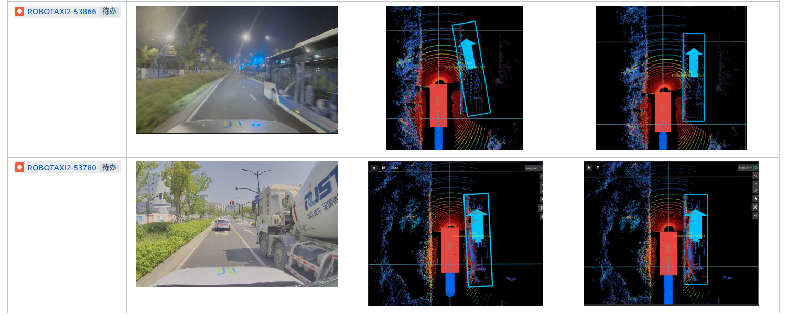
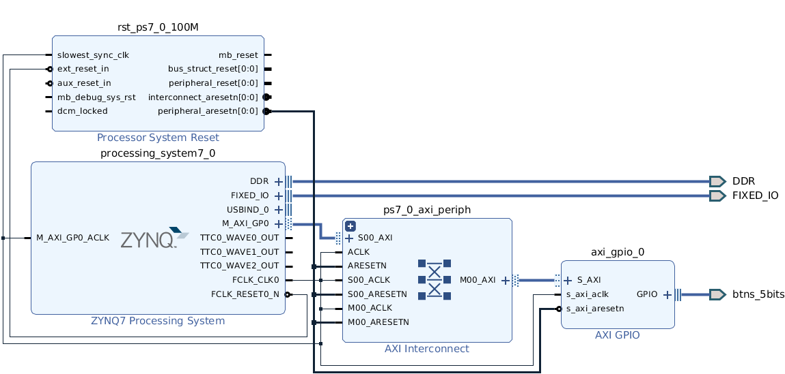
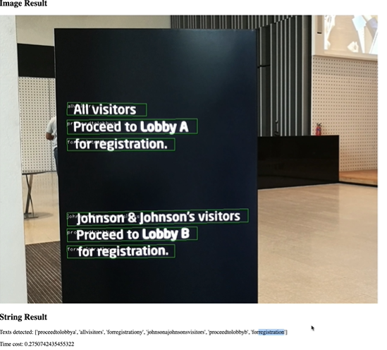
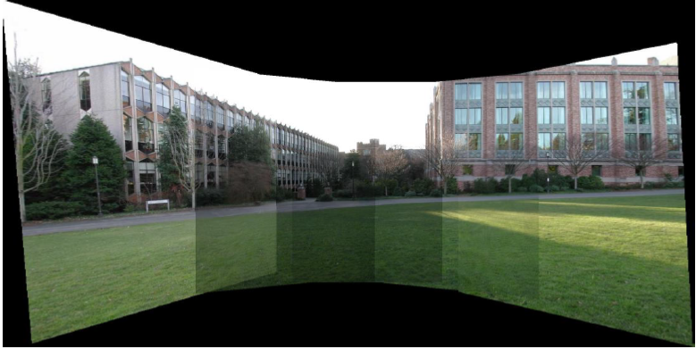
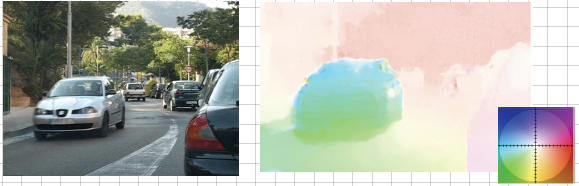

**Part of the Work and Material**

---

- <a href="https://www.leiphone.com/category/transportation/cb1blVAcxAzxHqq8.html" target="_blank">
End-to-End Perception with VLA Model (Been Interviewed with "新智驾")</a>

    This project utilizes the VLA model for scene recognition and critical object detection. Combining Internet-level pre-training data and actual collected annotations, we can train a model with scene understanding capabilities to solve corner cases that are difficult to handle with traditional perception algorithms. For specific technical details, please refer to the [official account](https://mp.weixin.qq.com/s/kW6D1uLp3P45EMo3-IgaVg){:target="_blank"}

- Robust Heading Correction Algorithm with PCD

    In this algorithm, point cloud is innovatively used as the basis for angle correction of the adjacent special-shaped cart. Combining the detected bounding box and its internal point cloud, the detection deviation of the cart's heading angle can be controlled within 0.5°. Such method not only reduces the possible intrusion of predicted lines into the ego's driving trajectory, but also ensures that there will be no more braking situations when driving close to a cart.

**Class Projects and Material**

---

- <a href="../assets/pdf/EE4218Demo.pdf" target="_blank"> 
Embedded Hardware System Design Demonstration </a> 

    This is a demo slide for the final project of the module [EE4218](https://nusmods.com/modules/EE4218/embedded-hardware-system-design){:target="_blank"} (Autumn, 2019), taught by [Dr. Rajesh](https://www.ece.nus.edu.sg/stfpage/raje/){:target="_blank"} in NUS. It includes nearly all the processes in an FPGA design, from sequential logic optimization, behavioral synthesis, architectural synthesis to scheduling and binding, technology mapping, physical synthesis. The project is to implement a neural network on the system-on-chip, and utilize FPGA to accelerate the inference stage.

- [Demo](https://www.youtube.com/watch?v=do7jV_T61yg){:target="_blank"} (or [this on bilibili](https://www.bilibili.com/video/av56362371){:target="_blank"}) for a scene text extraction model developed with my teamate Kevin.

    The model shown in the demo is based on [Connectionist Text Proposal Network](https://arxiv.org/pdf/1609.03605.pdf){:target="_blank"} and [Convolutional Recurrent Neural Network](https://arxiv.org/pdf/1507.05717.pdf){:target="_blank"}. There are still many problems with this model, such as not good at detecting oriented text (vertical anchor nature), expensive computation (repeated convolution and heavy VGG) and two separate stages for detection and recognition. **From a later view, this project is a good attempt for my work of object detection in autonomous driving.**
    <!-- <iframe width="560" height="315" src="https://www.youtube.com/embed/do7jV_T61yg" frameborder="40" allow="accelerometer; autoplay; encrypted-media; gyroscope; picture-in-picture" allowfullscreen></iframe> -->

- <a href="../assets/pdf/EE5907HelpSheet.pdf" target="_blank"> Pattern Recognition Help Sheet </a> 

    This is a help sheet for the module [EE5907](https://nusmods.com/modules/EE5907/pattern-recognition){:target="_blank"} (Spring, 2019), taught by [Dr. Thomas](https://sites.google.com/view/yeolab/thomas){:target="_blank"} and [Dr. Jiashi](https://sites.google.com/site/jshfeng/){:target="_blank"} in NUS. It includes some topics in pattern recognition ranging from Naive Bayes Classifier to Convolutional Neural Networks. The module gives me an overview of the field and this help sheet was prepared for the final exam.

- <a href="../assets/pdf/EE4212HelpSheet.pdf" target="_blank"> Computer Vision Help Sheet </a> 

    This is a help sheet for the module [EE4212](https://nusmods.com/modules/EE4212/computer-vision){:target="_blank"} (Spring, 2019), taught by <a href="https://www.ece.nus.edu.sg/stfpage/eleclf/" target="_blank"> Dr. Cheong </a> and [Dr. Jiashi](https://sites.google.com/site/jshfeng/){:target="_blank"} in NUS. It includes both mid-level vision, such as stereo analysis and structure from motion, and techniques for processing images like segmentation, HDR and panorama, etc. This module is not much related to deep learning approaches, instead, it outlines some traditional vision challenges and methods. This help sheet was prepared for the final exam as a brief summary ;D

**Transcripts**

---

- <a href="../assets/img/certificate/TP.pdf" target="_blank"> 
Transcripts in HIT </a>

- <a href="../assets/img/certificate/HKTP.pdf" target="_blank"> 
Transcripts in HK PolyU </a>

